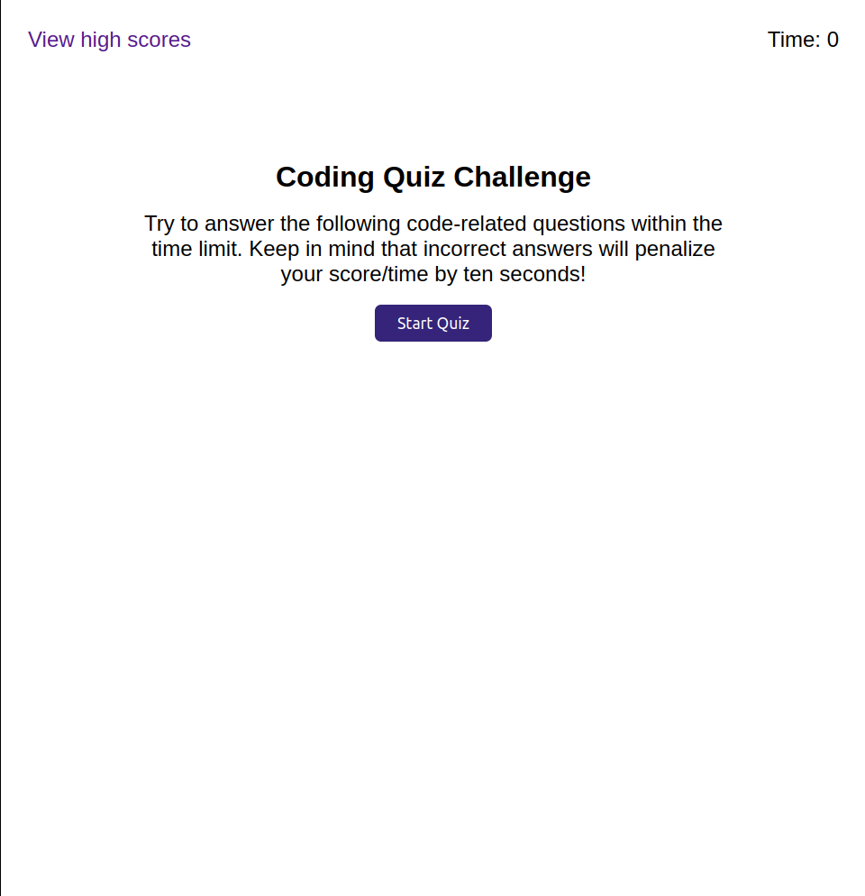
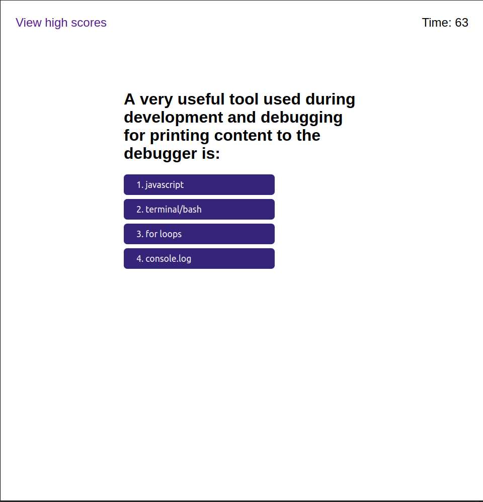
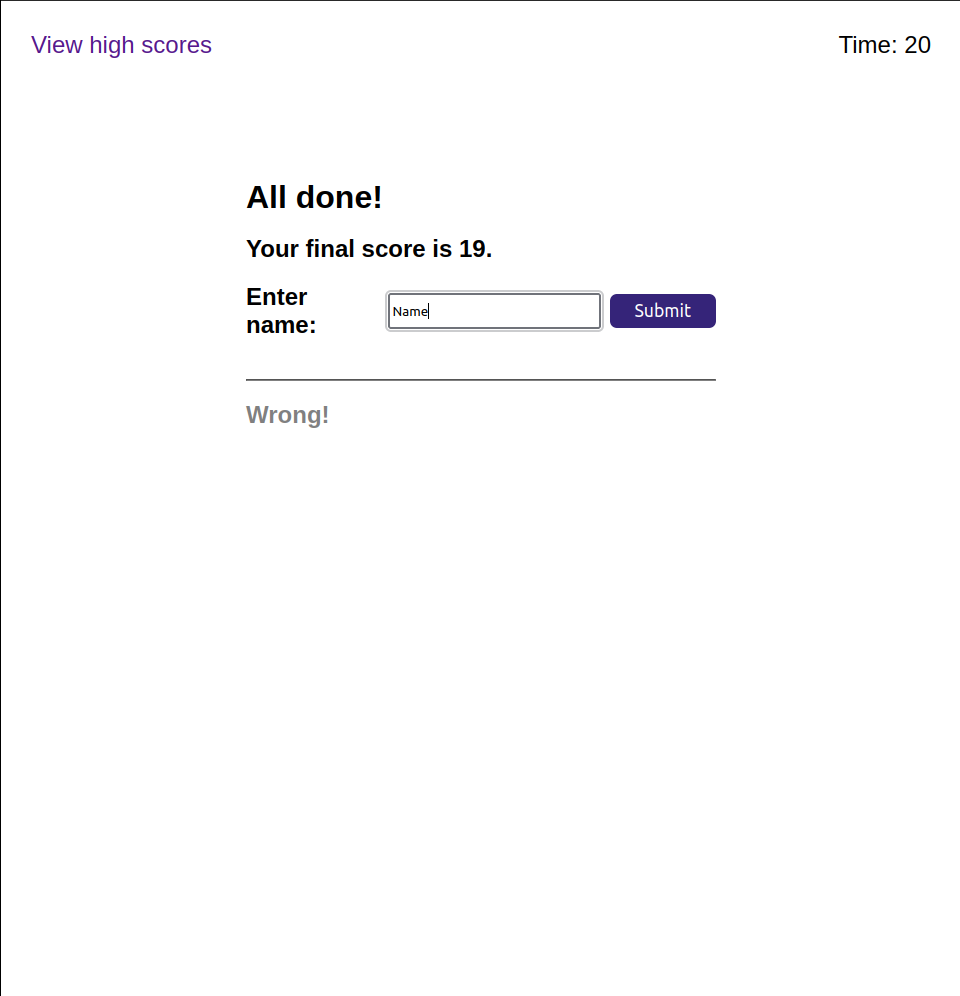
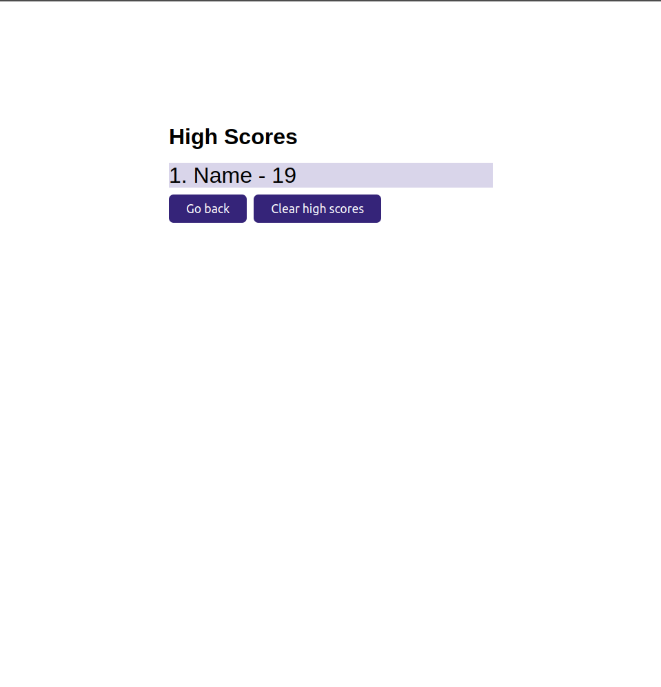

# Code Quiz

## Description
A timed multiple choice coding quiz to help you become a better programmer and help you study for interviews. You can track your high scores and keep improving.

## Usage
Just click the Start Quiz button to begin. Answerer all the questions as fast as you can to improve your score. Don't get any questions wrong because you will loose 10 seconds.

You can check out the website through this [link](https://ryansheehy0.github.io/Module_4_Challenge/).

## Source Code
This source code can be found within the folder docs.

